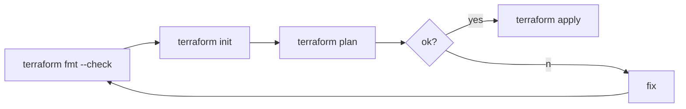

## Boost your terraform automation

:rocket: 

---

### Who am I?

- Bruno Ferreira 👨‍💻
- Father of one 👨‍👧
- 🌩️ engineer @ [Moteefe](https://moteefe.com/) (we're hiring!)

Note:
My name is Bruno Ferreira, I'm a proud father of one little girl and I'm currently a cloud engineer at moteefe.

---

### Terraform workflow



Note: 
If you worked with terraform before, you'll know that typical workflow in terraform looks more or less like this. On your ci/cd pipeline you start by checking the format, then you have to run init to initialize the working directory by downloading the submodules that you might be using and initialize the backend where the status is stored and then you run plan.
On the plan you verify what stuff will be deleted/created/modified by your changes and if you're ok with that, you procceed with the apply, otherwise you fix it and you start from the beginning of the process.
Here on this simple example there's already one simple thing that we could automate, that is on the plan step, get the output directly as a comment on our pull request.

---


---

## Best practices and possible errors

### [TfLint](https://github.com/terraform-linters/tflint)

:mag_right: 

---

### [TfLint](https://github.com/terraform-linters/tflint)

* Enforces best practices
  - unused var declarations, module sources through git should be pinned, etc
* Catches possible errors that are not detected during plan
  - invalid amis, instance types, ...
* 700+ rules are available
* Custom rules (to enforce patterns in s3 bucket names for example)
* AWS, Azure and GCP

Note:
Let's start with TFLint. A tool that helps you to enforce best practices on your terraform projects, for example by checking unused var declarations, module sources using git should be pinned, and others. 
It also catches errors that won't be detected during plan and that would only be detected when running apply such as invalid amis or invalid instance types.
It has more than 700+ rules available and also supports custom rules, for example to enforce patterns in s3 bucket names. It supports AWS, azure and GCP.

---

### [TfLint](https://github.com/terraform-linters/tflint)


Note: 
You can add it easily to your pipeline for example with review dog to comment directly on the pull request. Here's an example where it was reported that the name of the instance type is wrong, also there's no such thing as gp10 as a ebs volume type (we have gp2 and more recently gp3), and also, this AMI ID looks a bit weird!
As I said before, these are simple errors that would just be catched when running apply and here you catch it after you merge you Pull Request to master.

---

### Tests

#### [Terratest](https://github.com/infracost/infracost)

:ballot_box_with_check: :negative_squared_cross_mark: 

Go library to write automated tests for infrastructure code

Note:
And finally, for tests automation we have terratests that is a go library to write automated tests for infra code. And here I used it in two different ways.

---

#### Terratest with [Localstack](https://github.com/localstack/localstack)

```hcl
provider "aws" {
  region                      = "us-east-1"
  access_key                  = "mock_access_key"
  secret_key                  = "mock_secret_key"
  skip_credentials_validation = true
  skip_metadata_api_check     = true
  skip_requesting_account_id  = true
  s3_force_path_style         = true

  endpoints {
    ec2 = "http://localhost:4566"
    iam = "http://localhost:4566"
    s3  = "http://localhost:4566"
  }
}
```

Note:
The first one was with localstack. Basically localstack is a AWS emulator that mocks the aws services. You can run it inside a docker container and instead of calling aws endpoints you call this server that emulates aws.
On your provider configuration you have to set some parameters to be able to run terraform pointing to localstack and the important part are the endpoints.

---

#### Terratest with [Localstack](https://github.com/localstack/localstack)

```go
terraformOptions := &terraform.Options{
    TerraformDir: "../../local",
    EnvVars: map[string]string{
        "AWS_REGION":         awsRegion,
    },    
}
    
defer terraform.Destroy(t, terraformOptions)

terraform.InitAndApply(t, terraformOptions)

actualStatus := aws.GetS3BucketVersioning(t, 
    awsRegion, "awesome-bucket")
expectedStatus := "Enabled"
assert.Equal(t, expectedStatus, actualStatus)
```

Note:
And a test looks like this. You set some options on the test like the AWS_REGION, you defer the destroy to execute after the test, you run init and apply to create the resources on the mocked server and then you do the assertions. In this case an S3 bucket should have been created with versioning enabled. 

---


Note:
I already tried to use localstack a few times, I really like the concept but I always feel that I spend more time fixing problems related to it than writing actual tests. Sometimes the resource creation gets stuck for example. It has great potential to be a usefull tool, I just don't think it is right now.

---

## Terratest with "The Real Thing"

* More reliable
* Use a dev environment
* Run [aws-nuke](https://github.com/rebuy-de/aws-nuke) or [cloud-nuke](https://github.com/gruntwork-io/cloud-nuke) once in a while :fireworks: 

Note:
So my advice is to use terratest with the real thing. It is more reliable and you can use a dev aws environment that you can nuke once in a while to avoid unnecessary costs. [aws-nuke](https://github.com/rebuy-de/aws-nuke) or [cloud-nuke](https://github.com/gruntwork-io/cloud-nuke) are tools that can help you with that.

---

## Security

### [Checkov](https://github.com/bridgecrewio/checkov)

:lock: 

Note: Regarding security, we have this tool called checkov!

---

#### [Checkov](https://github.com/bridgecrewio/checkov)

* 400+ rules for security and compliance best practices
* AWS, Azure and Google Cloud
* Scans Terraform, CloudFormation and Kubernetes, Serverless framework and ARM template files
* Detects AWS credentials in EC2 Userdata, Lambda environment variables and Terraform providers 


Note:
Like tflint, It is also a static analysis tool that has more than 400 rules, supports AWS azure and GCP an scans terraform, kubernetes files, cloudformation etc.
It also detects AWS credetials in ec2 userdata, lambda env vars and terraform providers. Let's see some examples.

---

#### [Checkov](https://github.com/bridgecrewio/checkov)


Note: 
Here it detected that this ebs volume was not encrypted and it raises an Error, blocking the PR to be merged.

---

#### [Checkov](https://github.com/bridgecrewio/checkov)


Note:
And what about access logging for the bucket? That can be usefull!

---

#### [Checkov](https://github.com/bridgecrewio/checkov)

[](https://docs.bridgecrew.io/docs/s3_13-enable-logging)

Note:
And all of these issues have a link for the description of the error with a clear Rationale, which is really usefull. And obviously, you can always ignore a specific error if you really don't care about it.

---

### Cost Management

#### [Infracost](https://github.com/infracost/infracost)

:moneybag: 

A tool to estimate costs automatically in every pull request

Note:
For cost management automation we have infracost that estimates costs automatically in every pull request based on the modifications you did on the pull request. I found this tool really cool! Let's see an example.

---

#### [Infracost](https://github.com/infracost/infracost)


Note:
I opened a pull request where I changed the instance type from t3.micro to t3.xlarge and right on the pull request I get a comment saying that now the monthly cost for this can increase from 114 to 239! If you're always on a budget, this is really usefull to help you on the pull request reviews.

---


[https://github.com/bmbferreira/awesome-terraform-pipeline](https://github.com/bmbferreira/awesome-terraform-pipeline)

Note:
All of these tools that I showed here I set a project to test them that you can take a look if you want to use it as a starting point to test some of these. I used github actions and the workflow looks like this.

---

Much more!

* **[tfSec](https://github.com/tfsec/tfsec)** - https://github.com/tfsec/tfsec 
* **[terrascan](https://github.com/accurics/terrascan)** - https://github.com/accurics/terrascan
* **[terraform-compliance](https://terraform-compliance.com/)** - https://terraform-compliance.com/
* **[awesome-terraform-repo](https://github.com/shuaibiyy/awesome-terraform)** - https://github.com/shuaibiyy/awesome-terraform

Note:
You also have some alternatives to some of the tools that I presented here, for example regarding security you have also tfSec and terrascan. I just preferred checkov because of the documentation of the reported issues. Terraform-compliance is almost like cucumber for infrastructure, so you can do tests with Given when then, It's on my todo list to try it. And on top of that you have the awesome-terraform-repo that has lots of tools related with terraform.

---

### Thank you! :wave:

@bmbferreira
<p float="left">
  
   
</p>

Note:
So thank you, hope you enjoyed the presentation. This is my handle on twitter and github. if you have any question or know any usefull tools or tips that you currently use that improves you work with terraform, please share it with me! 